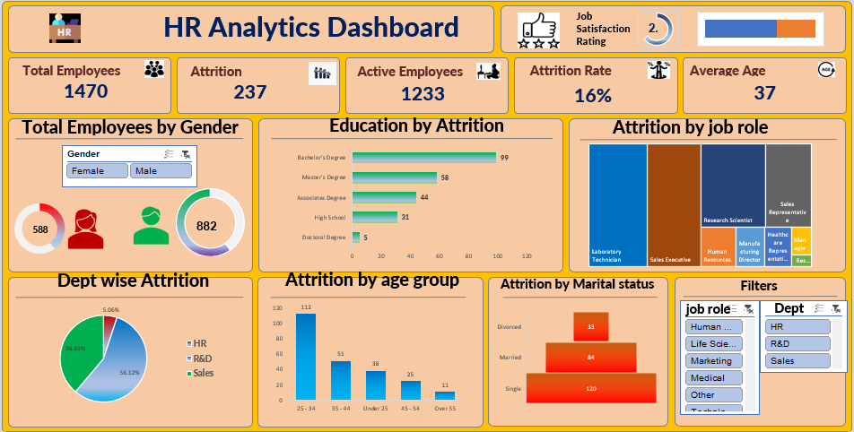

# 📊 HR Analytics Dashboard

An interactive **HR Analytics Dashboard** developed using **Tableau** to analyze employee attrition, workforce demographics, and job satisfaction. The dashboard transforms raw HR data into actionable insights, enabling HR teams to monitor workforce trends and support data-driven decision-making.

---

## 🎯 Project Objectives

- Analyze employee attrition across different demographics.
- Monitor workforce KPIs through an interactive dashboard.
- Identify departments and employee groups with high attrition.
- Enable HR professionals to explore data using dynamic filters.

---

## 📈 Dashboard Features

- 📌 KPI Cards for Total Employees, Active Employees, Attrition Count, Attrition Rate, and Average Age.
- 📊 Department-wise Attrition Analysis.
- 🎓 Education-wise Attrition Analysis.
- 👨‍💼 Job Role-wise Attrition Analysis.
- 👥 Gender-wise Attrition Distribution.
- 📅 Age Group-wise Attrition Analysis.
- ⭐ Job Satisfaction Heatmap.
- 🎛 Interactive Filters for dynamic exploration.

---

## 🛠 Tools & Technologies

- Tableau Public
- Microsoft Excel
- Data Cleaning
- Data Visualization
- Dashboard Design

---

## 📷 Dashboard Preview

<p align="center">
  
</p>

---

## 📊 Key Metrics

| Metric | Value |
|---------|------:|
| Total Employees | **1,470** |
| Active Employees | **1,233** |
| Employee Attrition | **237** |
| Attrition Rate | **16.12%** |
| Average Employee Age | **37 Years** |

---

## 💡 Business Insights

- **16.12%** of the workforce (**237 out of 1,470 employees**) has left the organization.
- The **Sales department accounts for 56.12% (133 employees)** of total attrition, making it the highest among all departments.
- Employees aged **25–34 years** represent the largest share of attrition (**112 employees**), indicating higher turnover among early-career professionals.
- Employees with a **Life Sciences education** contribute the highest attrition (**89 employees**), followed by Medical (**63 employees**).
- Male employees recorded **150 attritions (63.3%)**, while female employees recorded **87 attritions (36.7%)**.
- The **Sales Executive** role experiences the highest attrition among all job roles.
- The average employee age is **37 years**, providing insight into the organization's workforce demographics.

---

## 🚀 Skills Demonstrated

- Data Cleaning
- Data Visualization
- Dashboard Development
- KPI Design
- HR Analytics
- Business Intelligence
- Analytical Thinking
- Tableau

---

## 📌 Live Dashboard

🔗 **Tableau Public:** *(https://public.tableau.com/views/HRSALESDASHBOARD_17857023656450/HRAnalyticsDashboard?:language=en-US&publish=yes&:sid=&:redirect=auth&:display_count=n&:origin=viz_share_link)*

---

## 📂 Repository Contents

```text
HR-Analytics-Dashboard/
│── README.md
│── HR_Analytics_Dashboard.twbx
│── HR_Employee_Data.xlsx
│── HR-ANALYTICS-DASHBOARD.png
└── Project_Report.pdf
```
